
<a href="https://www.mathis-fournier.com/en/"><picture><source media="(prefers-color-scheme: dark)" srcset="assets/vide.svg"><source media="(max-width: 599px)" srcset="assets/heros-etroit-jour.svg"><source media="(min-width: 768px) and (max-width: 899px)" srcset="assets/heros-etroit-jour.svg"></picture><picture><source media="(prefers-color-scheme: light)" srcset="assets/vide.svg"><source media="(max-width: 599px)" srcset="assets/heros-etroit-soir.svg"><source media="(min-width: 768px) and (max-width: 899px)" srcset="assets/heros-etroit-soir.svg"></picture></a> <picture><source media="(prefers-color-scheme: dark)" srcset="assets/vide.svg"><source media="(min-width: 600px) and (max-width: 767px)" srcset="assets/accroche-moyen-jour.svg"><source media="(min-width: 900px) and (max-width: 1145px)" srcset="assets/accroche-moyen-jour.svg"><source media="(min-width: 1146px)" srcset="assets/accroche-large-jour.svg">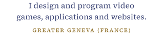</picture><picture><source media="(prefers-color-scheme: light)" srcset="assets/vide.svg"><source media="(min-width: 600px) and (max-width: 767px)" srcset="assets/accroche-moyen-soir.svg"><source media="(min-width: 900px) and (max-width: 1145px)" srcset="assets/accroche-moyen-soir.svg"><source media="(min-width: 1146px)" srcset="assets/accroche-large-soir.svg">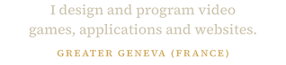</picture>

<a href="https://www.mathis-fournier.com/en/projects/gueux-vs-mafieux/"><picture><source media="(prefers-color-scheme: dark) and (max-width: 665px)" srcset="assets/piece-1-soir.svg"><source media="(prefers-color-scheme: dark) and (min-width: 768px) and (max-width: 947px)" srcset="assets/piece-1-soir.svg"><source media="(prefers-color-scheme: dark) and (min-width: 666px) and (max-width: 767px)" srcset="assets/mur-moyen-1-soir.svg"><source media="(prefers-color-scheme: dark) and (min-width: 948px) and (max-width: 1145px)" srcset="assets/mur-moyen-1-soir.svg"><source media="(prefers-color-scheme: dark) and (min-width: 1146px) and (max-width: 1279px)" srcset="assets/mur-median-1-soir.svg"><source media="(prefers-color-scheme: dark)" srcset="assets/mur-1-soir.svg"><source media="(min-width: 666px) and (max-width: 767px)" srcset="assets/mur-moyen-1-jour.svg"><source media="(min-width: 948px) and (max-width: 1145px)" srcset="assets/mur-moyen-1-jour.svg"><source media="(min-width: 1146px) and (max-width: 1279px)" srcset="assets/mur-median-1-jour.svg"><source media="(min-width: 1280px)" srcset="assets/mur-1-jour.svg"></picture></a><a href="https://www.mathis-fournier.com/en/projects/esquant/"><picture><source media="(prefers-color-scheme: dark) and (max-width: 665px)" srcset="assets/piece-2-soir.svg"><source media="(prefers-color-scheme: dark) and (min-width: 768px) and (max-width: 947px)" srcset="assets/piece-2-soir.svg"><source media="(prefers-color-scheme: dark) and (min-width: 666px) and (max-width: 767px)" srcset="assets/mur-moyen-2-soir.svg"><source media="(prefers-color-scheme: dark) and (min-width: 948px) and (max-width: 1145px)" srcset="assets/mur-moyen-2-soir.svg"><source media="(prefers-color-scheme: dark) and (min-width: 1146px) and (max-width: 1279px)" srcset="assets/mur-median-2-soir.svg"><source media="(prefers-color-scheme: dark)" srcset="assets/mur-2-soir.svg"><source media="(min-width: 666px) and (max-width: 767px)" srcset="assets/mur-moyen-2-jour.svg"><source media="(min-width: 948px) and (max-width: 1145px)" srcset="assets/mur-moyen-2-jour.svg"><source media="(min-width: 1146px) and (max-width: 1279px)" srcset="assets/mur-median-2-jour.svg"><source media="(min-width: 1280px)" srcset="assets/mur-2-jour.svg"></picture></a><a href="https://www.mathis-fournier.com/en/projects/moteur-directx-12/"><picture><source media="(prefers-color-scheme: dark) and (max-width: 665px)" srcset="assets/piece-3-soir.svg"><source media="(prefers-color-scheme: dark) and (min-width: 768px) and (max-width: 947px)" srcset="assets/piece-3-soir.svg"><source media="(prefers-color-scheme: dark) and (min-width: 666px) and (max-width: 767px)" srcset="assets/mur-moyen-3-soir.svg"><source media="(prefers-color-scheme: dark) and (min-width: 948px) and (max-width: 1145px)" srcset="assets/mur-moyen-3-soir.svg"><source media="(prefers-color-scheme: dark) and (min-width: 1146px) and (max-width: 1279px)" srcset="assets/mur-median-3-soir.svg"><source media="(prefers-color-scheme: dark)" srcset="assets/mur-3-soir.svg"><source media="(min-width: 666px) and (max-width: 767px)" srcset="assets/mur-moyen-3-jour.svg"><source media="(min-width: 948px) and (max-width: 1145px)" srcset="assets/mur-moyen-3-jour.svg"><source media="(min-width: 1146px) and (max-width: 1279px)" srcset="assets/mur-median-3-jour.svg"><source media="(min-width: 1280px)" srcset="assets/mur-3-jour.svg"></picture></a><a href="https://www.mathis-fournier.com/en/projects/splatoon-io/"><picture><source media="(prefers-color-scheme: dark) and (max-width: 665px)" srcset="assets/piece-4-soir.svg"><source media="(prefers-color-scheme: dark) and (min-width: 768px) and (max-width: 947px)" srcset="assets/piece-4-soir.svg"><source media="(prefers-color-scheme: dark) and (min-width: 666px) and (max-width: 767px)" srcset="assets/mur-moyen-4-soir.svg"><source media="(prefers-color-scheme: dark) and (min-width: 948px) and (max-width: 1145px)" srcset="assets/mur-moyen-4-soir.svg"><source media="(prefers-color-scheme: dark) and (min-width: 1146px) and (max-width: 1279px)" srcset="assets/mur-median-4-soir.svg"><source media="(prefers-color-scheme: dark)" srcset="assets/mur-4-soir.svg"><source media="(min-width: 666px) and (max-width: 767px)" srcset="assets/mur-moyen-4-jour.svg"><source media="(min-width: 948px) and (max-width: 1145px)" srcset="assets/mur-moyen-4-jour.svg"><source media="(min-width: 1146px) and (max-width: 1279px)" srcset="assets/mur-median-4-jour.svg"><source media="(min-width: 1280px)" srcset="assets/mur-4-jour.svg"></picture></a><a href="https://www.mathis-fournier.com/en/projects/beacon/"><picture><source media="(prefers-color-scheme: dark) and (max-width: 665px)" srcset="assets/piece-5-soir.svg"><source media="(prefers-color-scheme: dark) and (min-width: 768px) and (max-width: 947px)" srcset="assets/piece-5-soir.svg"><source media="(prefers-color-scheme: dark) and (min-width: 666px) and (max-width: 767px)" srcset="assets/mur-moyen-5-soir.svg"><source media="(prefers-color-scheme: dark) and (min-width: 948px) and (max-width: 1145px)" srcset="assets/mur-moyen-5-soir.svg"><source media="(prefers-color-scheme: dark) and (min-width: 1146px) and (max-width: 1279px)" srcset="assets/mur-median-5-soir.svg"><source media="(prefers-color-scheme: dark)" srcset="assets/mur-5-soir.svg"><source media="(min-width: 666px) and (max-width: 767px)" srcset="assets/mur-moyen-5-jour.svg"><source media="(min-width: 948px) and (max-width: 1145px)" srcset="assets/mur-moyen-5-jour.svg"><source media="(min-width: 1146px) and (max-width: 1279px)" srcset="assets/mur-median-5-jour.svg"><source media="(min-width: 1280px)" srcset="assets/mur-5-jour.svg"></picture></a>

<a href="https://www.mathis-fournier.com/en/projects/"><picture><source media="(prefers-color-scheme: dark)" srcset="assets/vide.svg"></picture><picture><source media="(prefers-color-scheme: light)" srcset="assets/vide.svg"></picture></a><a href="https://www.mathis-fournier.com/en/gallery/"><picture><source media="(prefers-color-scheme: dark)" srcset="assets/vide.svg"></picture><picture><source media="(prefers-color-scheme: light)" srcset="assets/vide.svg"></picture></a>

<picture><source media="(prefers-color-scheme: dark)" srcset="assets/vide.svg"></picture><picture><source media="(prefers-color-scheme: light)" srcset="assets/vide.svg"></picture>

I am a developer, trained in video game programming in Lyon. I started with games, and that is where I learned the core of the job: writing code that holds its frame rate, structuring a project as a team, and shipping on a short deadline.

On the game side, I first worked with Unity and Unreal Engine, then went lower: a rendering engine in C++ and DirectX 12, a multiplayer game on a client-server architecture, an arcade game built on an ECS architecture.

<a href="https://www.mathis-fournier.com/en/skills/"><picture><source media="(prefers-color-scheme: dark)" srcset="assets/vide.svg"><source media="(min-width: 600px) and (max-width: 767px)" srcset="assets/competences-moyen-jour.svg"><source media="(min-width: 900px) and (max-width: 1145px)" srcset="assets/competences-moyen-jour.svg"><source media="(min-width: 1146px)" srcset="assets/competences-large-jour.svg">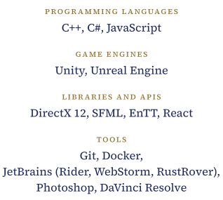</picture><picture><source media="(prefers-color-scheme: light)" srcset="assets/vide.svg"><source media="(min-width: 600px) and (max-width: 767px)" srcset="assets/competences-moyen-soir.svg"><source media="(min-width: 900px) and (max-width: 1145px)" srcset="assets/competences-moyen-soir.svg"><source media="(min-width: 1146px)" srcset="assets/competences-large-soir.svg">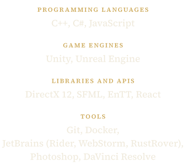</picture></a>

<!-- jardin:debut -->

<picture><source media="(prefers-color-scheme: dark)" srcset="assets/vide.svg"><source media="(min-width: 600px) and (max-width: 767px)" srcset="assets/jardin-moyen-jour.svg"><source media="(min-width: 900px) and (max-width: 1145px)" srcset="assets/jardin-moyen-jour.svg"><source media="(min-width: 1146px)" srcset="assets/jardin-large-jour.svg"></picture><picture><source media="(prefers-color-scheme: light)" srcset="assets/vide.svg"><source media="(min-width: 600px) and (max-width: 767px)" srcset="assets/jardin-moyen-soir.svg"><source media="(min-width: 900px) and (max-width: 1145px)" srcset="assets/jardin-moyen-soir.svg"><source media="(min-width: 1146px)" srcset="assets/jardin-large-soir.svg"></picture>

<!-- jardin:fin -->

<picture><source media="(prefers-color-scheme: dark)" srcset="assets/vide.svg"><source media="(min-width: 600px) and (max-width: 767px)" srcset="assets/invitation-moyen-jour.svg"><source media="(min-width: 900px) and (max-width: 1145px)" srcset="assets/invitation-moyen-jour.svg"><source media="(min-width: 1146px)" srcset="assets/invitation-large-jour.svg">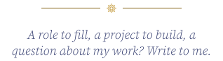</picture><picture><source media="(prefers-color-scheme: light)" srcset="assets/vide.svg"><source media="(min-width: 600px) and (max-width: 767px)" srcset="assets/invitation-moyen-soir.svg"><source media="(min-width: 900px) and (max-width: 1145px)" srcset="assets/invitation-moyen-soir.svg"><source media="(min-width: 1146px)" srcset="assets/invitation-large-soir.svg">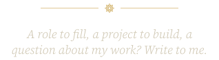</picture> <a href="mailto:mathis.fournier74930@gmail.com"><picture><source media="(prefers-color-scheme: dark)" srcset="assets/vide.svg"><source media="(min-width: 480px)" srcset="assets/contact-courriel-large-jour.svg"></picture><picture><source media="(prefers-color-scheme: light)" srcset="assets/vide.svg"><source media="(min-width: 480px)" srcset="assets/contact-courriel-large-soir.svg"></picture></a> <a href="https://www.linkedin.com/in/mathis-fournier-b581b42a4/"><picture><source media="(prefers-color-scheme: dark)" srcset="assets/vide.svg"><source media="(min-width: 480px)" srcset="assets/contact-linkedin-large-jour.svg"></picture><picture><source media="(prefers-color-scheme: light)" srcset="assets/vide.svg"><source media="(min-width: 480px)" srcset="assets/contact-linkedin-large-soir.svg"></picture></a><a href="https://spades74.itch.io/"><picture><source media="(prefers-color-scheme: dark)" srcset="assets/vide.svg"><source media="(min-width: 480px)" srcset="assets/contact-itch-large-jour.svg"></picture><picture><source media="(prefers-color-scheme: light)" srcset="assets/vide.svg"><source media="(min-width: 480px)" srcset="assets/contact-itch-large-soir.svg"></picture></a><a href="https://www.mathis-fournier.com/en/"><picture><source media="(prefers-color-scheme: dark)" srcset="assets/vide.svg"><source media="(min-width: 480px)" srcset="assets/contact-site-large-jour.svg"></picture><picture><source media="(prefers-color-scheme: light)" srcset="assets/vide.svg"><source media="(min-width: 480px)" srcset="assets/contact-site-large-soir.svg"></picture></a>

<picture><source media="(prefers-color-scheme: dark)" srcset="assets/vide.svg"><source media="(min-width: 600px) and (max-width: 767px)" srcset="assets/colophon-moyen-jour.svg"><source media="(min-width: 900px) and (max-width: 1145px)" srcset="assets/colophon-moyen-jour.svg"><source media="(min-width: 1146px)" srcset="assets/colophon-large-jour.svg">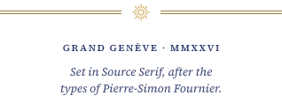</picture><picture><source media="(prefers-color-scheme: light)" srcset="assets/vide.svg"><source media="(min-width: 600px) and (max-width: 767px)" srcset="assets/colophon-moyen-soir.svg"><source media="(min-width: 900px) and (max-width: 1145px)" srcset="assets/colophon-moyen-soir.svg"><source media="(min-width: 1146px)" srcset="assets/colophon-large-soir.svg">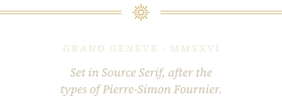</picture>

Version française

 

<picture><source media="(prefers-color-scheme: dark)" srcset="assets/vide.svg"><source media="(min-width: 600px) and (max-width: 767px)" srcset="assets/accroche-fr-moyen-jour.svg"><source media="(min-width: 900px) and (max-width: 1145px)" srcset="assets/accroche-fr-moyen-jour.svg"><source media="(min-width: 1146px)" srcset="assets/accroche-fr-large-jour.svg">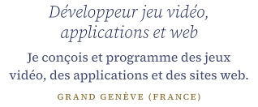</picture><picture><source media="(prefers-color-scheme: light)" srcset="assets/vide.svg"><source media="(min-width: 600px) and (max-width: 767px)" srcset="assets/accroche-fr-moyen-soir.svg"><source media="(min-width: 900px) and (max-width: 1145px)" srcset="assets/accroche-fr-moyen-soir.svg"><source media="(min-width: 1146px)" srcset="assets/accroche-fr-large-soir.svg">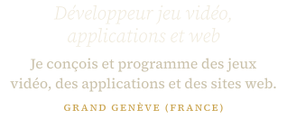</picture>

<a href="https://www.mathis-fournier.com/projets/gueux-vs-mafieux/"><picture><source media="(prefers-color-scheme: dark)" srcset="assets/vide.svg"><source media="(min-width: 666px) and (max-width: 767px)" srcset="assets/cartel-fr-moyen-1-jour.svg"><source media="(min-width: 948px) and (max-width: 1145px)" srcset="assets/cartel-fr-moyen-1-jour.svg"></picture><picture><source media="(prefers-color-scheme: light)" srcset="assets/vide.svg"><source media="(min-width: 666px) and (max-width: 767px)" srcset="assets/cartel-fr-moyen-1-soir.svg"><source media="(min-width: 948px) and (max-width: 1145px)" srcset="assets/cartel-fr-moyen-1-soir.svg"></picture></a><a href="https://www.mathis-fournier.com/projets/esquant/"><picture><source media="(prefers-color-scheme: dark)" srcset="assets/vide.svg"><source media="(min-width: 666px) and (max-width: 767px)" srcset="assets/cartel-fr-moyen-2-jour.svg"><source media="(min-width: 948px) and (max-width: 1145px)" srcset="assets/cartel-fr-moyen-2-jour.svg">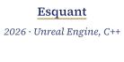</picture><picture><source media="(prefers-color-scheme: light)" srcset="assets/vide.svg"><source media="(min-width: 666px) and (max-width: 767px)" srcset="assets/cartel-fr-moyen-2-soir.svg"><source media="(min-width: 948px) and (max-width: 1145px)" srcset="assets/cartel-fr-moyen-2-soir.svg"></picture></a><a href="https://www.mathis-fournier.com/projets/moteur-directx-12/"><picture><source media="(prefers-color-scheme: dark)" srcset="assets/vide.svg"><source media="(min-width: 666px) and (max-width: 767px)" srcset="assets/cartel-fr-moyen-3-jour.svg"><source media="(min-width: 948px) and (max-width: 1145px)" srcset="assets/cartel-fr-moyen-3-jour.svg">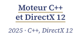</picture><picture><source media="(prefers-color-scheme: light)" srcset="assets/vide.svg"><source media="(min-width: 666px) and (max-width: 767px)" srcset="assets/cartel-fr-moyen-3-soir.svg"><source media="(min-width: 948px) and (max-width: 1145px)" srcset="assets/cartel-fr-moyen-3-soir.svg">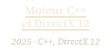</picture></a><a href="https://www.mathis-fournier.com/projets/splatoon-io/"><picture><source media="(prefers-color-scheme: dark)" srcset="assets/vide.svg"><source media="(min-width: 666px) and (max-width: 767px)" srcset="assets/cartel-fr-moyen-4-jour.svg"><source media="(min-width: 948px) and (max-width: 1145px)" srcset="assets/cartel-fr-moyen-4-jour.svg">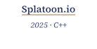</picture><picture><source media="(prefers-color-scheme: light)" srcset="assets/vide.svg"><source media="(min-width: 666px) and (max-width: 767px)" srcset="assets/cartel-fr-moyen-4-soir.svg"><source media="(min-width: 948px) and (max-width: 1145px)" srcset="assets/cartel-fr-moyen-4-soir.svg">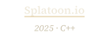</picture></a><a href="https://www.mathis-fournier.com/projets/beacon/"><picture><source media="(prefers-color-scheme: dark)" srcset="assets/vide.svg"><source media="(min-width: 666px) and (max-width: 767px)" srcset="assets/cartel-fr-moyen-5-jour.svg"><source media="(min-width: 948px) and (max-width: 1145px)" srcset="assets/cartel-fr-moyen-5-jour.svg"></picture><picture><source media="(prefers-color-scheme: light)" srcset="assets/vide.svg"><source media="(min-width: 666px) and (max-width: 767px)" srcset="assets/cartel-fr-moyen-5-soir.svg"><source media="(min-width: 948px) and (max-width: 1145px)" srcset="assets/cartel-fr-moyen-5-soir.svg"></picture></a>

<a href="https://www.mathis-fournier.com/projets/"><picture><source media="(prefers-color-scheme: dark)" srcset="assets/vide.svg"></picture><picture><source media="(prefers-color-scheme: light)" srcset="assets/vide.svg"></picture></a><a href="https://www.mathis-fournier.com/galerie/"><picture><source media="(prefers-color-scheme: dark)" srcset="assets/vide.svg"></picture><picture><source media="(prefers-color-scheme: light)" srcset="assets/vide.svg"></picture></a>

<picture><source media="(prefers-color-scheme: dark)" srcset="assets/vide.svg"></picture><picture><source media="(prefers-color-scheme: light)" srcset="assets/vide.svg"></picture>

Je suis développeur, formé à la programmation de jeux vidéo à Lyon. J’ai commencé par le jeu, et c’est là que j’ai appris l’essentiel du métier : écrire du code qui tient la cadence, structurer un projet à plusieurs et livrer dans un délai court.

Côté jeu, j’ai d’abord travaillé avec Unity et Unreal Engine, puis je suis descendu plus bas : un moteur de rendu en C++ et DirectX 12, un jeu multijoueur en architecture client-serveur, un jeu d’arcade construit sur une architecture ECS.

<a href="https://www.mathis-fournier.com/competences/"><picture><source media="(prefers-color-scheme: dark)" srcset="assets/vide.svg"><source media="(min-width: 600px) and (max-width: 767px)" srcset="assets/competences-fr-moyen-jour.svg"><source media="(min-width: 900px) and (max-width: 1145px)" srcset="assets/competences-fr-moyen-jour.svg"><source media="(min-width: 1146px)" srcset="assets/competences-fr-large-jour.svg">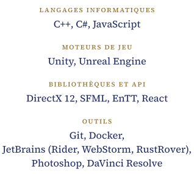</picture><picture><source media="(prefers-color-scheme: light)" srcset="assets/vide.svg"><source media="(min-width: 600px) and (max-width: 767px)" srcset="assets/competences-fr-moyen-soir.svg"><source media="(min-width: 900px) and (max-width: 1145px)" srcset="assets/competences-fr-moyen-soir.svg"><source media="(min-width: 1146px)" srcset="assets/competences-fr-large-soir.svg">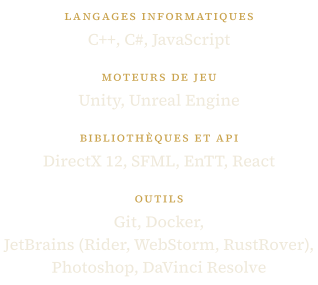</picture></a>

<picture><source media="(prefers-color-scheme: dark)" srcset="assets/vide.svg"><source media="(min-width: 600px) and (max-width: 767px)" srcset="assets/invitation-fr-moyen-jour.svg"><source media="(min-width: 900px) and (max-width: 1145px)" srcset="assets/invitation-fr-moyen-jour.svg"><source media="(min-width: 1146px)" srcset="assets/invitation-fr-large-jour.svg">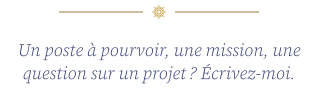</picture><picture><source media="(prefers-color-scheme: light)" srcset="assets/vide.svg"><source media="(min-width: 600px) and (max-width: 767px)" srcset="assets/invitation-fr-moyen-soir.svg"><source media="(min-width: 900px) and (max-width: 1145px)" srcset="assets/invitation-fr-moyen-soir.svg"><source media="(min-width: 1146px)" srcset="assets/invitation-fr-large-soir.svg">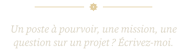</picture> <a href="mailto:mathis.fournier74930@gmail.com"><picture><source media="(prefers-color-scheme: dark)" srcset="assets/vide.svg"><source media="(min-width: 480px)" srcset="assets/contact-courriel-large-jour.svg"></picture><picture><source media="(prefers-color-scheme: light)" srcset="assets/vide.svg"><source media="(min-width: 480px)" srcset="assets/contact-courriel-large-soir.svg"></picture></a> <a href="https://www.linkedin.com/in/mathis-fournier-b581b42a4/"><picture><source media="(prefers-color-scheme: dark)" srcset="assets/vide.svg"><source media="(min-width: 480px)" srcset="assets/contact-linkedin-large-jour.svg"></picture><picture><source media="(prefers-color-scheme: light)" srcset="assets/vide.svg"><source media="(min-width: 480px)" srcset="assets/contact-linkedin-large-soir.svg"></picture></a><a href="https://spades74.itch.io/"><picture><source media="(prefers-color-scheme: dark)" srcset="assets/vide.svg"><source media="(min-width: 480px)" srcset="assets/contact-itch-large-jour.svg"></picture><picture><source media="(prefers-color-scheme: light)" srcset="assets/vide.svg"><source media="(min-width: 480px)" srcset="assets/contact-itch-large-soir.svg"></picture></a><a href="https://www.mathis-fournier.com/"><picture><source media="(prefers-color-scheme: dark)" srcset="assets/vide.svg"><source media="(min-width: 480px)" srcset="assets/contact-site-large-jour.svg"></picture><picture><source media="(prefers-color-scheme: light)" srcset="assets/vide.svg"><source media="(min-width: 480px)" srcset="assets/contact-site-large-soir.svg"></picture></a>

<picture><source media="(prefers-color-scheme: dark)" srcset="assets/vide.svg"><source media="(min-width: 600px) and (max-width: 767px)" srcset="assets/colophon-fr-moyen-jour.svg"><source media="(min-width: 900px) and (max-width: 1145px)" srcset="assets/colophon-fr-moyen-jour.svg"><source media="(min-width: 1146px)" srcset="assets/colophon-fr-large-jour.svg">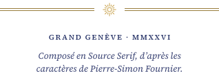</picture><picture><source media="(prefers-color-scheme: light)" srcset="assets/vide.svg"><source media="(min-width: 600px) and (max-width: 767px)" srcset="assets/colophon-fr-moyen-soir.svg"><source media="(min-width: 900px) and (max-width: 1145px)" srcset="assets/colophon-fr-moyen-soir.svg"><source media="(min-width: 1146px)" srcset="assets/colophon-fr-large-soir.svg">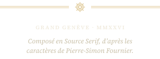</picture>

